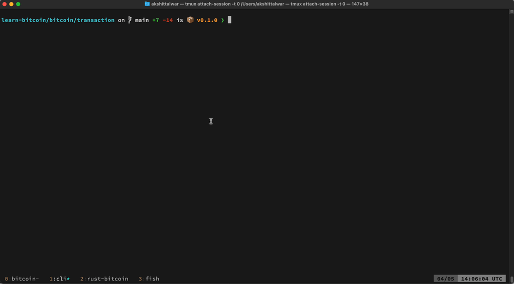

# Bitcoin Transaction
This repo contains a Bitcoin transaction parser written in Rust.

## Instructions
From the root of the directory, 
- `cargo run` to run the user-facing cli
- `cargo test` to run the test suite

## Functionality
There are essentially 4 main features:
1. **Create a new transaction** - interactively through cli input create a raw transaction hex.
2. **Create a new script** - create a P2SH, P2PKH, or custom script through user input. You can enter an assembly formatted script or simply enter the hex if you already have it.
3. **Decode a raw transaction** - given a raw transaction in Bitcoin-encoded hex, decode and pretty-print it so that it is human-readable. Supports Segwit transactions.
4. **Decode a script** - given a raw script in hex, decode and pretty-print it so that it is readable. Supports all opcodes and script types.

## File structure
- `main.rs` - entry point for the user-facing cli.
- `txio.rs` - in-memory buffers are used to interact with raw data so code in this file contains abstractions of reading and writing, taking care of endianness.
- `transaction.rs`  - all parsing related to transactions.
- `script.rs` - all parsing related to scripts.
- `hash.rs` - helper functions to hash bytes.
- `opcodes.rs` - a list of all opcodes supported in script
